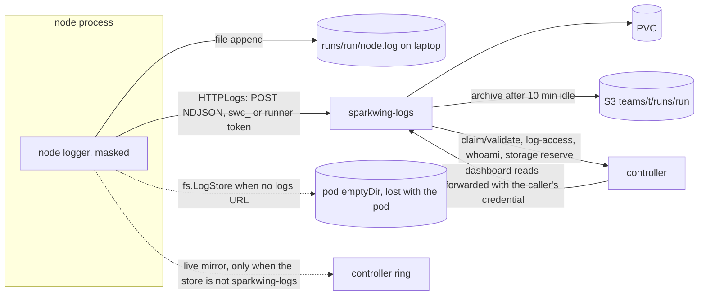
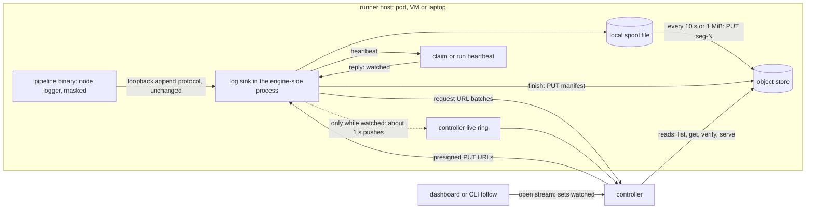
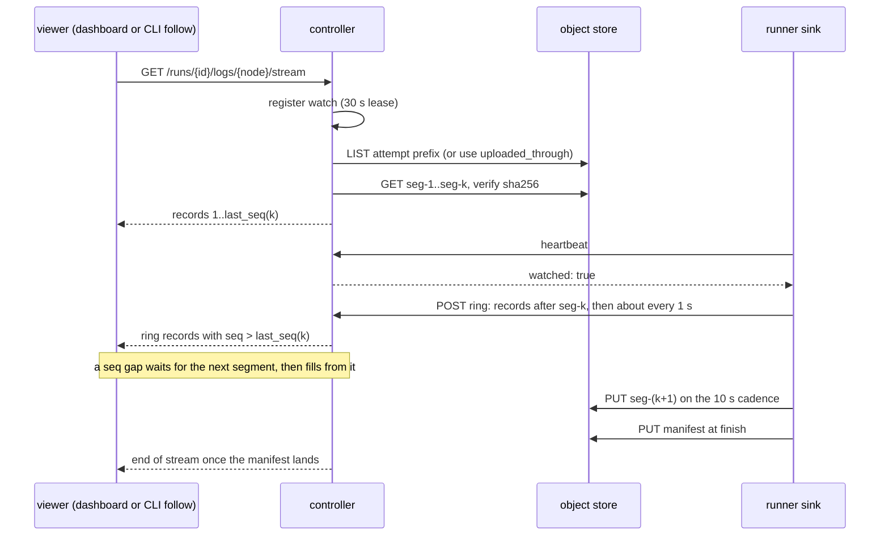
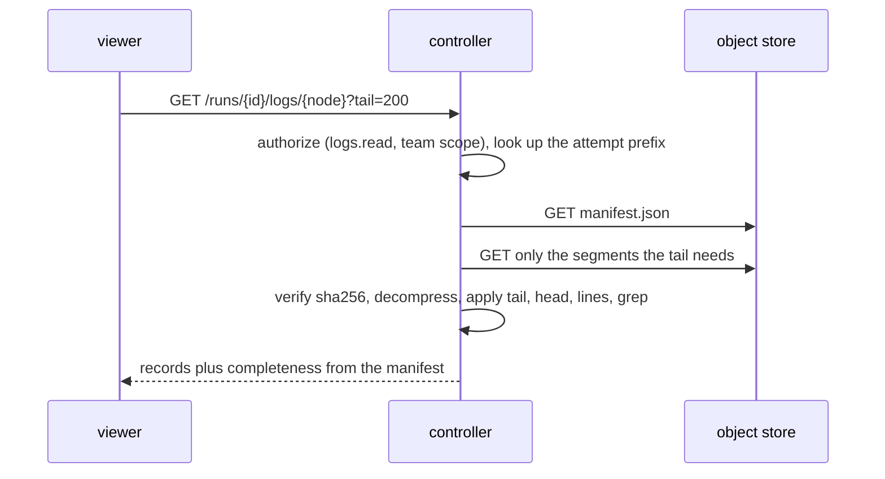
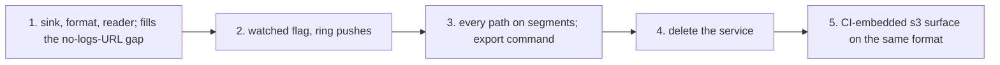

# Logs without a logs service

Status: proposal. This page is a design for contributors; no released
command behaves this way yet.

Sparkwing deletes `sparkwing-logs`. A node keeps its own log on local disk
and uploads it to object storage in numbered segments while it runs. A
manifest seals the log when the node finishes. The controller holds no log
bytes at rest: it issues upload URLs, keeps a short in-memory ring of live
lines for nodes someone is watching, and serves reads from the object store.
No process ever connects inbound to a runner.

What this removes: one Deployment, one PersistentVolume, one credential
kind, the logs service's own quota, retention, archive and egress code, and
two of the three ways a node log reaches a reader today.

## Goals and constraints

- A runner lost mid-run costs at most one segment, about 10 s or 1 MiB of
  output. The reader marks that log incomplete; it never presents a partial
  log as whole.
- Storage cost follows real output. An idle node writes nothing.
- Live lines cost nothing unless a viewer has the node open.
- No inbound reads to runners: runners sit behind NAT, and a listening
  runner is attack surface.
- Masking stays in the node. No service ever receives an unmasked secret.
- Pipeline binaries built against older SDKs keep logging on every cluster
  path. The node-side protocol a pipeline binary speaks does not change.
- Laptop runs keep working with no controller.

## Today

Three different stores hold node logs, chosen per execution path. Only the
logs service seals a log, so only logs that went through it can report
whether they are complete.



| Piece | Where it lives today |
|---|---|
| Store interface | `storage.LogStore` in `pkg/storage/storage.go`; seal is an optional interface checked in `internal/orchestrator/httplogs.go` |
| Node-side writer | `HTTPLogs` in `internal/orchestrator/httplogs.go`: 256 lines, 64 KiB or 100 ms batches, a per-line sequence number and a running SHA-256, `seal()` on `Close` |
| Laptop writer | `localLogs` in `internal/orchestrator/backends.go`, writing `runs/<run>/<node>.log` (`internal/paths/paths.go`) |
| Object-store writer | `pkg/storage/logbatch` over `pkg/storage/s3/logs.go`: one object per flush, 2 s or 256 KiB, capped at 2000 objects and 64 MiB per node |
| Seal and completeness | `pkg/logs/seal.go` (states streaming, complete, incomplete, cut_off, unconfirmed, unknown); readers in `internal/backend/completeness.go` |
| Live ring | `pkg/controller/livelogs.go` and `livelogs_http.go`: 512 KiB per node, 64 MiB total, 1024 nodes, 10 min idle release |
| Masking | `wrapNodeLogWithMasker` in `internal/orchestrator/nodelog_mask.go`; child output through `secrets.ChildValues.Writer` (`internal/secrets/child_values.go`) |
| Logs service | `cmd/sparkwing-logs` (261 lines) and `pkg/logs` (5,988 non-test lines, 6,173 test lines) |
| Archive | `pkg/logs/archive.go`: raw `.log` files under `teams/<team>/runs/<run>/`, 90 d retention, 30 d for a team without credits |
| Dashboard reads | `pkg/controller/browser_reads.go` builds a `sparkwinglogs` client and forwards the viewer's credential; handlers in `internal/web/reads.go` |

### Write path by execution path

| Execution path | Entry | Store chosen today | Credential |
|---|---|---|---|
| Laptop, no profile | CLI runs the pipeline binary; `internal/runners/local` spawns `run-node --coordinated` per node | `localLogs`, `runs/<run>/<node>.log` | none |
| Laptop, profile with a logs surface | same | `OpenLogStoreFromSpec` in `pkg/storage/storeurl/spec.go`: filesystem, s3 with logbatch, stdout, or controller (which means sparkwing-logs) | the profile's token, which carries `logs.write` |
| k8s Job | `sparkwing-runner run-node` from `internal/runners/k8s/k8s.go`; `RunNodeOnce` in `internal/orchestrator/run_node.go` | `HTTPLogs` when `SPARKWING_LOGS_URL` is set, else `localLogs` on the pod's emptyDir | runner token in `SPARKWING_AGENT_TOKEN` |
| Warm runner | `internal/cluster/runner_pool_cli.go`, `executePooledNode`, then a brokered child (`run_node_remote.go`) | the child posts to `remote_execution_broker.go`, which forwards `/api/v1/logs/*` to the logs URL with the runner token and claim fence headers | runner token |
| Launcher | `internal/runners/launcher/job.go`; `runLaunchedNode` in `internal/orchestrator/claim_exec.go` execs the pipeline with the inherited environment | `HTTPLogs` with the `swc_` claim token and a live mirror, else `fs.LogStore` on the pod's disk | claim token `swc_` (`pkg/store/launch_claim.go`) |
| Self-hosted agent | `internal/cluster/runner_agent_cli.go`, same pool loop as the warm runner | as the warm runner; the logs URL comes from the agent config's `logs:` field | runner token minted by `sparkwing runners add` |
| GitHub Actions runner | `sparkwing runner --github-actions`; Actions OIDC exchanged at `/api/v1/runners/github/exchange` (`pkg/controller/github_runners.go`) | as the warm runner; no logs URL default, so without `--logs` the log stays on the Actions VM | runner token with `logs.write` |
| CI-embedded | the pipeline binary inside a CI job, no controller | the profile's `s3` surface with logbatch, or `stdout` | the CI job's cloud credentials |

Three paths lose logs silently today: a k8s Job, warm runner or launcher
started without a logs URL writes the log to disk that dies with the pod.

## Design

### Overview



The log sink is one new component, `pkg/storage/logseg` in this design. It
takes appends, writes them to a spool file, cuts segments, uploads them
through an uploader, pushes to the ring while watched, and writes the
manifest. It runs in whatever process the engine owns on that host:

- the runner or broker process on cluster paths, so a pipeline binary built
  against any SDK keeps speaking the existing append protocol over loopback
  and never learns about segments;
- the pipeline binary itself on laptop and CI-embedded paths, where no
  engine-side process exists.

### Write path per execution path

| Execution path | Who runs the sink | How the pipeline binary reaches it | Uploads through |
|---|---|---|---|
| Laptop, no controller | the pipeline binary (`localLogs` stays) | in-process | nothing: the spool file is the log |
| Laptop, remote profile | the pipeline binary | in-process | the profile's controller: URL batches on the run owner's token |
| k8s Job | `sparkwing-runner run-node` | the brokered child posts to the broker over loopback, as today | controller presign, runner token plus claim fence |
| Warm runner | the runner's broker (`remote_execution_broker.go`) | unchanged: the broker already terminates `/api/v1/logs/*` from the child | controller presign, runner token plus claim fence |
| Launcher | `runLaunchedNode` serves the loopback append endpoint and sets `SPARKWING_LOGS_URL` to it for the child | the child's existing `HTTPLogs` posts there with its `swc_` token | controller presign, claim token |
| Self-hosted agent | the agent's broker | as the warm runner | controller presign, runner token |
| GitHub Actions runner | the runner's broker | as the warm runner | controller presign, the exchanged runner token |
| CI-embedded | the pipeline binary | in-process | the CI job's own object-store credentials: the `s3` surface writes the same segment and manifest format directly |

The broker's existing log proxying (`remote_execution_broker.go`,
`remote_execution_log_seal.go`) is the template: it already terminates the
child's append and seal calls and owns numbering for children that do not
number their own lines. The sink replaces the forward-to-URL step with
spool-and-segment. Children keep sending `X-Sparkwing-Log-Stream` and the
sequence headers; the sink keeps them so the manifest can record gaps.

The trigger loop's direct writes of the `_compile` node and baseline
warnings (`internal/cluster/trigger_loop.go`, through `logs.Client.Append`)
go through the same sink, so they gain a manifest too.

### Segment cutting

The sink appends every record to the spool file first, then cuts a segment
when either holds:

- 10 s have passed since the last cut and at least one byte is pending;
- 1 MiB is pending.

An idle node uploads nothing. The final segment is cut at node finish, on
success, failure and cancellation, before the node's terminal status is
written (the order `handOverNodeLog` in `internal/orchestrator/backends.go`
already enforces).

The existing per-node bounds carry over unchanged: 64 MiB per node and the
line-length and binary-output handling the logs service applies today
(`pkg/logs/limits.go`). Past the byte cap the sink stops cutting segments,
writes one truncation marker as the last segment and records the dropped
line count in the manifest. These are the bounds customers have today, so
no limit is new.

### Segment naming

```text
<prefix>/logs/r<days>/teams/<team>/runs/<run>/<node>/a<attempt>-g<gen>/seg-000001.ndjson.gz
<prefix>/logs/r<days>/teams/<team>/runs/<run>/<node>/a<attempt>-g<gen>/manifest.json
```

- `r<days>` is the retention class (see Retention). It leads the key so one
  lifecycle rule per class covers every team.
- `teams/<team>` keeps the `internal/teamblob` namespace, so the storage
  pass's per-team listing and team deletion keep working by prefix. A run
  with no team uses `teams/_` rather than the bucket root, which the logs
  archive uses today.
- `<node>` is the node ID with `/` replaced by `__`, as the logs service
  does, after `storage.SafeRelPath` validation.
- `a<attempt>-g<gen>` matches the output key scheme
  (`outputs/<run>/<node>/a<attempt>-g<gen>-...` in
  `pkg/store/node_output.go`), so a retried or re-claimed attempt never
  writes into another attempt's log.
- Segment numbers are six-digit, zero-padded and dense from 1, so a
  listing sorts in write order and a gap is visible without a manifest.
- Each segment is gzip-compressed NDJSON of masked `sparkwing.LogRecord`
  lines, each carrying its sequence number. gzip is in the standard
  library and every reader decodes it; zstd would add a dependency for
  roughly 20 % smaller objects.

The controller records the node attempt's log prefix in its run store when
it issues the first URL batch, so readers never guess a retention class.

### Manifest

The sink writes the manifest last, through a URL issued with the segment
batch. It seals the log.

```json
{
  "version": 1,
  "run": "run_01J9...",
  "node": "build",
  "attempt": 1,
  "generation": 3,
  "status": "complete",
  "reason": "",
  "sealed_by": "node",
  "sealed_at": "2026-10-08T17:04:05Z",
  "first_seq": 1,
  "last_seq": 18233,
  "lines": 18233,
  "bytes": 2411520,
  "dropped_lines": 0,
  "gaps": [],
  "segments": [
    {"n": 1, "first_seq": 1, "last_seq": 912, "lines": 912, "bytes": 131072, "stored_bytes": 22301, "sha256": "9f2c..."},
    {"n": 2, "first_seq": 913, "last_seq": 1904, "lines": 992, "bytes": 140211, "stored_bytes": 23977, "sha256": "41aa..."}
  ]
}
```

| Field | Meaning |
|---|---|
| `status` | `complete`, `incomplete` or `cut_off`; the reader derives `streaming` from a missing manifest on a running node |
| `reason` | for anything but `complete`: `runner lost`, `upload failed`, `byte cap`, `sequence gap` |
| `sealed_by` | `node` when the sink wrote it, `controller` when the controller sealed an abandoned attempt |
| `gaps` | sequence ranges the sink never received, from the child's sequence headers |
| `segments[].sha256` | digest of the stored (compressed) object; the reader verifies every segment it serves |
| `segments[].lines`, `first_seq`, `last_seq` | let a tail or head read fetch only the segments it needs |

The existing `Completeness` and `State*` types move out of `pkg/logs` next
to the manifest so `internal/backend/completeness.go` and the dashboard's
completeness route keep their contract.

When an attempt ends without a manifest, the controller seals it. Two
triggers do this:

- the claim reaper, when the attempt's claim lease expires (2 min) or the
  run reaper fires (3 min without a run heartbeat);
- a reader that finds a terminal node with no manifest.

Either lists the attempt's prefix and writes a manifest with `status:
incomplete`, `reason: runner lost`, `sealed_by: controller` and the
segments it found. A gap in segment numbers also yields `incomplete`.
Writing the manifest is a conditional create (`If-None-Match: *`, which
the controller's S3 client already uses in `pkg/controller/direct_upload.go`),
so a late node seal and a controller seal cannot both win.

### Upload URLs from the presigned data plane

Today's data plane issues one URL per call and checks size and SHA-256
against a reservation before a commit copy (`pkg/controller/direct_upload.go`,
`pkg/store/direct_upload.go`). That suits content-addressed artifacts and
costs three round trips per object. Log segments need neither the commit
copy nor content addressing: the key is fixed by run, node, attempt and
number, and only the claim holder may write it.

A new route issues URLs in batches:

```text
POST /api/v1/runs/{id}/nodes/{nodeID}/log-segments
  request:  {"attempt": 1, "generation": 3, "next": 17, "count": 16,
             "uploaded_through": 15, "stored_bytes": 412883}
  response: {"prefix": "...", "urls": [{"n": 17, "url": "...", "headers": {...}}, ...],
             "manifest_url": "...", "expires_at": "...", "watched": false}
```

- Auth: the claim token route group, falling back to `runs.state` plus
  `claimedBy` for a runner token, the same pairing `output-upload` uses
  (`outputCallerFor` in `pkg/store/node_output.go`). A laptop run against
  a remote profile uses the run owner's token on a run it created. The
  controller refuses a superseded attempt or generation, so a fenced-out
  runner cannot write the new attempt's log.
- Batch size 16 and URL lifetime 15 min, the existing presign TTL. At the
  10 s cadence one batch lasts at least 160 s; a node producing 1 MiB per
  second asks every 16 s.
- The sink asks for the next batch when fewer than 4 URLs remain or the
  batch is within 2 min of expiry.
- Every batch includes a fresh manifest URL, so a node that finishes after
  a long silence never holds an expired one.
- The request reports `uploaded_through` and `stored_bytes`, which the
  controller uses for live reads and storage accounting without listing
  the bucket.
- A controller with no object store issues HMAC-signed PUT URLs to its own
  disk, the mechanism outputs already use (`PUT /api/v1/outputs/uploads/{id}`
  in `pkg/controller/server.go`).

Presigned PUT URLs cannot bind an unknown size. The sink enforces the byte
cap; the controller charges what was actually stored, reported by the sink
and corrected by the hourly storage pass's listing
(`pkg/controller/storage_pass.go`). A node that lies about its size uploads
into its own team's storage and pays for it there. The bucket ceiling
(`runBucketCeiling` in `pkg/controller/objectstore.go`) stays the
operator's backstop, and the controller stops issuing log URLs while the
ceiling has frozen writes.

### Cost

Estimate, with S3 Standard list prices in us-east-1: $0.005 per 1,000 PUT
or LIST requests, $0.0004 per 1,000 GET requests, $0.023 per GB-month
stored. Lifecycle expiry is free. Traffic between S3 and a controller in
the same region is free.

Assumed typical run: 8 nodes, 3 minutes each, 300 KB of log per node,
output on most 10 s intervals, gzip ratio 6:1.

| Item per 1,000 runs | Count | Cost |
|---|---|---|
| Segment PUTs | 8 x 18 x 1,000 = 144,000 | $0.72 |
| Manifest PUTs | 8,000 | $0.04 |
| URL batch calls to the controller | about 16,000 | controller CPU only |
| Stored | 2.4 GB raw, 0.4 GB compressed | $0.009 per month; $0.028 over 90 days |
| Reads (one in ten runs viewed, one node each) | about 2,000 GETs and 100 LISTs | under $0.01 |
| Total | | about $0.80, almost all PUTs |

Request count, not bytes, dominates. At 1 million runs a month the PUT bill
is about $760; a 30 s cadence would cut it to about $260 at the price of
three times the loss window. A chatty node is capped by the 1 MiB cut: the
64 MiB node cap bounds it at about 64 size-triggered segments plus one per
10 s. A six-hour node that prints at least once every 10 s costs 2,160
PUTs, $0.011.

For comparison, the logs service volume in production holds an 8 GiB store
ceiling on EBS, about $0.64 a month idle, plus a Deployment, and its
archive writes one object per log file.

### The watched flag

A viewer opening a node's log stream on the controller registers a watch
on that node with a 30 s lease. The stream renews it while open; closing
the stream or missing a renewal lets it lapse.

Runners learn about watches from replies they already receive:

| Heartbeat | Reply today | Change |
|---|---|---|
| Claim heartbeat, launched pod (`handleClaimHeartbeat`, `pkg/controller/claim_run.go`), every 5 s | `{"cancel": bool}` | add `"watched": bool` |
| Claim heartbeat, pooled runner (`handleHeartbeatNodeClaim`, `pkg/controller/handlers.go`), every 3 s | 204, no body | 200 with `{"watched": bool}`; the client in `pkg/controller/client/client.go` accepts both so a runner of either version works with a controller of either version |
| Run heartbeat (`POST /runs/{id}/heartbeat`), every 30 s | 204 | 200 with `{"watched_nodes": [...]}` for nodes that run in-process without a per-node claim, such as a trigger's own nodes and laptop runs against a remote profile |
| `log-segments` reply | new | carries `watched` too |

While `watched` is true the sink pushes new records to the ring
(`POST /api/v1/runs/{id}/nodes/{nodeID}/logs`, the existing route) about
once a second. On the transition to watched it first pushes every record
after the last uploaded segment from its spool, so the ring joins the
segments without a gap. When `watched` turns false it stops pushing and
keeps cutting segments as before.

The watch registry lives in the controller's memory beside the ring.
Production and the chart run one controller replica; the ring itself is in
memory, so a second replica would need both moved together.

Dashboard and CLI follow set the flag the same way, by holding the stream
open: the dashboard's `GET /api/v1/runs/{id}/logs/{node}/stream` and
`sparkwing runs logs --follow`, which reads the same controller route. A
plain read of a finished or running log registers no watch.

### Live read path



- The controller stitches by sequence number: segments first, then ring
  records past the last segment's `last_seq`.
- If the ring's first record skips ahead (the ring holds 512 KiB, so a
  burst can evict lines), the controller holds the stream until the next
  segment covers the gap, then continues. The viewer never sees a hole
  silently.
- Before the flag reaches the runner, the viewer sees segments only, up to
  10 s behind. The flag reaches a claimed node within 3 to 5 s and an
  in-process node within 30 s.
- After a controller restart the ring is empty; the stream reconnects,
  reads segments and resumes from the ring once the runner sees the
  renewed watch.

### Finished read path



The controller proxies reads; it does not hand presigned GET URLs to
browsers. Proxying keeps today's format negotiation and pretty rendering
(`internal/web/logpretty.go`), applies `tail`, `head`, `lines` and `grep`
server side, needs no bucket CORS rule, works the same on the
controller-disk backend, and meters egress exactly. The CLI uses the same
routes through `internal/backend`.

Attempts: a read with no attempt selector returns the latest attempt, as
the logs service does today; an attempt selector reads an earlier one by
its prefix.

### Search and grep

| Surface today | After |
|---|---|
| `GET /api/v1/runs/{id}/logs/search` on the controller, which fans out one read per node (`RunLogsSearchHandler` in `internal/web/reads.go`) | unchanged; it reads segments through the new store |
| `GET /api/v1/runs/grep` on the controller (`RunsGrepHandler`) | unchanged |
| `sparkwing runs grep`, which calls the logs service per node (`RunGrepRemote` in `internal/orchestrator/runs_grep.go`) | calls the controller's `/api/v1/runs/grep` |
| `GET /api/v1/logs/search` on the logs service (`pkg/logs/search.go`) | removed: nothing calls it |

Grep decompresses and scans segments in the controller, streaming, within
the bounds the logs service enforces today: 256 MiB read and 10 s per
search (`SearchMaxBytes`, `SearchTimeout` in `pkg/logs/limits.go`). A
search that hits a bound says so in its reply. The manifest's per-segment
line counts let `grep` report line numbers without reading earlier
segments twice.

### Masking

Masking does not move. The node masks before the sink sees a record:
`wrapNodeLogWithMasker` for the node logger, `secrets.MaskingLogger` for
the run delegate, and `secrets.ChildValues.Writer` for a child's raw output.
Segments, the ring and the manifest hold masked bytes only. The controller
never receives a secret value, so it cannot unmask anything it serves.

### Retention

Retention is an object lifecycle rule per retention class, applied by key
prefix:

| Class prefix | Expires after | Who gets it |
|---|---|---|
| `logs/r90/` | 90 days | teams with credits, single-team installs (today's `DefaultArchiveRetention`) |
| `logs/r30/` | 30 days | teams without credits (today's `FreeArchiveRetention`) |

- The controller picks the class when it issues a node attempt's first URL
  batch, from the team's standing at that moment, and records it with the
  prefix. A team that later gains or loses credits changes the class of
  new runs only.
- A per-team retention beyond these two is an operator-defined class: the
  operator adds `logs/r<days>/` with a matching lifecycle rule and maps the
  team to it in controller config. S3 allows 1,000 lifecycle rules per
  bucket, far more than any class list needs.
- The operator owns the lifecycle rules (Terraform, the console or
  `aws s3api put-bucket-lifecycle-configuration`). At boot the controller
  reads the bucket's lifecycle configuration and refuses to issue log URLs
  into a class with no matching expiry rule, naming the missing rule. It
  never writes lifecycle rules itself, because a put replaces the bucket's
  whole configuration, including rules the operator owns for other
  prefixes.
- Run deletion and team deletion delete by prefix from the controller
  (`pkg/controller/deletion.go`), replacing the call to the logs service and
  its `logs.delete` token.
- The storage pass's `pruneLogsOverShare` deletes a team's oldest finished
  runs directly instead of calling `DELETE /api/v1/logs/<run>`.
- Laptop logs keep no retention, as today.
- An abandoned attempt's segments carry the class prefix, so they expire
  with everything else; nothing needs a separate sweep.

### Storage and egress accounting

| Concern | Today | After |
|---|---|---|
| Log quota | the logs service reserves 1 MiB blocks from the controller over `/internal/storage/*` with a forwarded `logs.write` credential (`pkg/logs/log_quota.go`, `storage_counters.go`) | the controller reserves a block in-process when it issues a URL batch, commits `stored_bytes` from the next batch request and from the manifest, and releases the rest at seal |
| Reconciliation | the storage pass lists the logs archive bucket (`--logs-archive-store`) | the storage pass lists `logs/` in the controller's own object store per team |
| Bucket ceiling | three ceilings: controller, logs service, cache | the controller's and the cache's |
| Egress | the logs service meters in memory and Prometheus only and reports no totals; signed `kind=log` downloads skip metering (`data_download.go`) | the controller meters every log byte it serves under the existing `log` and `log_stream` classes (`pkg/controller/egress.go`); signed log downloads are removed |
| Charging | log classes do not count against a team's download cap | unchanged |

### Laptop runs

Without a controller nothing changes for the writer: the node appends to
`runs/<run>/<node>.log` and that file is the whole log. The laptop
dashboard (`sparkwing serve`, `pkg/localws/localws.go`) stops building an
in-process logs service (`logs.NewPrivate`) and reads the files through the
filesystem `LogStore` instead. A laptop log stays `unknown` for
completeness, because the node's own status already says whether it
finished, and nothing can lose part of a local file short of the disk.

Against a remote profile, the pipeline binary runs the sink in-process: it
appends to the same local file and also cuts and uploads segments through
the profile's controller, on the run owner's token. Watches reach it in the
run heartbeat reply. A pipeline binary built against an SDK older than the
sink cannot upload; with the logs service gone its log stays local, and the
controller seals the remote copy as `incomplete`, reason `not uploaded`, so
the dashboard says where the log went rather than showing nothing.

The CI-embedded `s3` surface writes the same segments and manifest straight
to the customer's bucket with the CI job's credentials, replacing logbatch's
`<run>/<node>/<time>-<seq>.ndjson` keys. Its readers (`sparkwing serve
--profile ci-team`, `S3Backend` in `internal/backend/s3_backend.go`) read
both layouts, because objects in customers' buckets outlive any one
release. Reading the old layout is a listing and a concatenation, about
twenty lines.

### Logs archived by the logs service

The archive holds one raw, uncompressed `.log` file per attempt under
`[<prefix>/]teams/<team>/runs/<run>/`, seal records under `.seals/`, and
index objects under `index/` (`pkg/logs/archive.go`). Logs idle for less
than 10 minutes, and every log on an install without an archive (the chart
never sets `--archive-store`), live only on the service's volume.

The last release that ships `sparkwing-logs` adds `sparkwing-logs export
--to <object-store-url>`. It runs once, against the service's own volume
and archive, and:

1. archives every run still on the volume;
2. writes each attempt file as one segment plus a manifest in the new
   layout, picking the class from the archive's `index/free-days/` entries
   and deriving `status` from the seal records (`complete`, `incomplete`,
   `unconfirmed` maps to `incomplete` with reason `migrated without seal`);
3. reports counts and refuses to finish if any run failed to convert.

The controller then reads one format only. Runs older than the class's
retention expire on the normal schedule. An operator who skips the export
loses access to logs written before the upgrade; the migration guide says
so in its first step.

## Removal list

| Kind | Removed |
|---|---|
| Binary and package | `cmd/sparkwing-logs`; `pkg/logs` after `Completeness`, the seal types, `LogStreamHeader` and the loopback append handler move to `pkg/storage/logseg`; `pkg/storage/sparkwinglogs`; `.apidiff/pkg_logs.txt` (a breaking change to a public package) |
| Chart, runner bundle | `templates/logs-deployment.yaml`, `logs-pvc.yaml`, `logs-service.yaml`; the `logs:` block in `values.yaml`; logs entries in `_helpers.tpl`, `runner-deployment.yaml` (`--logs=`), `serviceaccount.yaml`, `validate.yaml`, `NOTES.txt`, `Chart.yaml`, `README.md` |
| Chart, full | `controller.logsURL` in `_helpers.tpl`; `--logs-url` in `controller-deployment.yaml`; `controller.logs.url` in `values.yaml`; mentions in `validate.yaml`, `NOTES.txt`, `Chart.yaml`, `README.md`; logs cases in `charts/render_test.go` |
| Controller flags and env | `--logs-url` / `SPARKWING_LOGS_URL`, `--logs-archive-store` / `SPARKWING_LOGS_ARCHIVE_STORE`, `SPARKWING_LOGS_DELETE_TOKEN` |
| Runner and CLI flags | `--logs` on `runner`, `agent`, `launch`, `run-node`, `handle-trigger` and `sparkwing runners add`; `--trigger-runner-logs-url`; the agent config's `logs:` field (`internal/agentconfig`); the profile's `logs.url` and `ExplicitLogsURL` (`internal/profile/profile.go`); `--logs` in the connect command the controller prints (`identity_team.go`) |
| Environment | `SPARKWING_LOGS_URL` as a user-facing setting (it survives only as the engine-to-child loopback address, see the decisions); `SPARKWING_LOGS_EGRESS_*` |
| Credentials | scopes `logs.write`, `logs.delete` and `logs.claim`; the `logs.write` grant in runner token scopes (`identity_team.go`, `cmd/sparkwing/runners.go`, `github_runners.go`); the forwarded-credential branch in `storage_counters.go`; `storagequota.KindLogs` and `ArchivedBytesDeletedHeader`. `logs.read` stays for reads |
| Controller routes | `POST /runs/{id}/nodes/{nodeID}/claim/validate`, `GET /runs/{id}/log-access`, the `logs` entry in `GET /api/v1/services` (`services.go`, `internal/discovery`), signed `kind=log` downloads in `data_download.go`; matching OpenAPI entries |
| Controller code | `dashboardLogs()` forwarding in `browser_reads.go`; logs-service calls in `deletion.go` and `storage_pass.go`; the `sparkwinglogs` capabilities label |
| Logs-service flags | all of `cmd/sparkwing-logs`'s flags go with it: `--addr`, `--root`, `--controller`, `--require-auth`, the byte and in-flight caps, `--retention`, `--sweep-interval`, search bounds, `--max-line-bytes`, `--binary-ratio`, store ceiling flags, `--archive-store`, `--archive-idle` |
| Build and release | `sparkwing-logs` in `bin/build-release-target.sh`, `build-release-images.sh`, `assemble-image-digests.sh`, `publish-image-tags.sh`, `install.sh`, `k8s-e2e.sh`, `release_images_test.go`; `.github/workflows/release.yaml`; `.sparkwing/jobs/build.go`, `build_images.go`, `publish_image_tags_test.go`; `internal/releaseasset/target.go`; `internal/doccheck/serviceports.go`; `.golangci.yml`, `.gitignore` entries |
| Laptop | the in-process logs service in `pkg/localws` and the `SPARKWING_LOGS_URL` it writes to `dev.env` |
| Docs | `observability.md`, `limits.md`, `auth.md`, `self-hosting.md`, `security.md`, `deployment-modes.md`, `architecture.md`, `node-protocol.md`, `cli-runs.md`, `api.md`, `api-reference.md`, `backup-restore.md`, `cli-cloud.md`, `cli-cluster.md`, `environment-variables.md`, `getting-started.md`, `local-execution.md`, `backends.md`, `ci-embedded.md`, package docs in `pkg/backends`, `pkg/storage`, `pkg/localws`; a (Breaking) changelog entry and a migration section |

The `controller` logs surface type stays: it now means segments through the
controller rather than the logs service.

## Phased plan



1. **Smallest first step.** Add `pkg/storage/logseg` (spool, cutter,
   manifest, uploader, reader, completeness), the controller's
   `log-segments` route, the controller-side seal for abandoned attempts,
   and a controller `LogStore` that reads segments. Turn it on only where a
   runner has no logs URL, which today loses the log with the pod. No
   configured deployment changes, no flag is removed, and the paths that
   lose logs today stop losing them. A conformance run of
   `pkg/storage/conformance.TestLogStore` covers the reader.
2. **Watched.** Add the watch registry, `watched` in the claim and run
   heartbeat replies, and sink pushes to the ring. Remove the always-on live
   mirror (`liveLogsRedundant` in `internal/orchestrator/livelogs.go`).
3. **Every path on segments.** Brokers, the launcher's loopback sink and
   laptop-remote profiles write segments whether or not a logs URL is set;
   dashboard and CLI reads come from the controller store; `runs grep`
   moves to the controller route. Ship `sparkwing-logs export` in this
   release. The logs service still runs, so an operator can roll back.
4. **Delete.** Remove everything in the removal list in one hard cut, with
   a (Breaking) changelog entry and a migration section: before and after
   chart values, the export step, the lifecycle rules to add, and the flags
   to drop from runner and agent configs.
5. **CI-embedded.** Move the `s3` surface from logbatch keys to segments and
   manifests, with the dual-layout reader.

Each phase builds and ships on its own. Phase 4 waits until production has
run on phase 3 for at least one full retention class, or until the export
has run there.

## Failure modes

| Failure | Effect | Detection |
|---|---|---|
| Runner lost mid-run | at most the segment being cut plus records not yet flushed, about 10 s or 1 MiB | the reaper seals the attempt `incomplete`, reason `runner lost`; the dashboard shows the state |
| Segment PUT fails | the sink retries with backoff from 200 ms to 2 s, three times, then keeps the bytes in the spool and retries at the next cut | after finish-time retries fail, the manifest records `incomplete`, reason `upload failed`, and a `logs_drop` event fires as it does for logbatch today |
| Controller unreachable | already-issued URLs keep working for up to 15 min; the claim heartbeat fails, so the claim is lost on the existing schedule | as for runner loss once the claim expires |
| Object store unreachable | uploads fail and the spool grows on local disk | as for a failed PUT; the controller's read path returns 503 naming the store |
| URL batch expired | the sink requests a new batch before cutting | none needed |
| Retry writes a segment twice | the key is fixed per number, so the second PUT overwrites identical bytes | the manifest digest matches |
| Superseded attempt keeps writing | its URLs name its own attempt and generation; the controller refuses it new batches | the reader serves the latest attempt |
| Spool disk full | the sink cannot keep records | dropped lines counted in the manifest and a `logs_drop` event, as today's drop policy |
| Segment missing or digest mismatch at read | the reader serves what verifies and stops at the first bad segment | completeness `incomplete`, naming the segment |
| Node seal and controller seal race | conditional create on the manifest lets one win | the loser's write fails and it rereads |
| Watch lease stuck on | a runner pushes to the ring for at most one lease after the viewer leaves | lease expiry |
| Ring evicts lines during a burst | the live stream waits for the next segment | seq gap check in the controller |
| Controller restart | ring and watches are lost | viewers reconnect, read segments, renew watches |
| Lifecycle rule missing | logs never expire | the controller refuses to issue URLs into that class and names the missing rule |
| Old SDK pipeline binary on a laptop with a remote profile | the log stays local | the remote copy is sealed `incomplete`, reason `not uploaded` |

## Decisions for Korey

Each item names a recommendation concrete enough that "yes" answers it.

1. **Where the sink runs.** In the engine-side process on every cluster
   path (runner, broker, launcher's trusted process), with the pipeline
   binary speaking the existing append protocol over loopback; in the
   pipeline binary only on laptop and CI-embedded paths. Recommendation:
   yes. It keeps every pipeline binary built against an older SDK logging
   on cluster paths with no SDK change.
2. **`SPARKWING_LOGS_URL` after the cut.** Keep the name as the internal
   engine-to-child loopback address and remove it from user-facing docs,
   or rename it. Recommendation: keep the name. Older pipeline binaries
   read exactly that variable; renaming it breaks them for no gain.
3. **Segment cadence.** 10 s or 1 MiB, fixed, no operator setting.
   Recommendation: fixed. It costs about $0.72 per 1,000 typical runs in
   PUTs; revisit with measured request counts before adding a knob.
4. **URL issuance.** A new `log-segments` route returning 16 presigned PUT
   URLs plus a manifest URL per call, 15 min lifetime, rather than the
   reserve, PUT and commit flow artifacts use. Recommendation: yes.
5. **Segment size enforcement.** Unsized presigned PUTs, with the sink
   enforcing the 64 MiB cap and the controller charging measured bytes,
   rather than presigned POST policies with a size range. Recommendation:
   unsized PUTs. POST policies are not supported by every S3-compatible
   store (Cloudflare R2 has none), and an over-uploading node only fills
   its own team's storage.
6. **Retention mechanism.** Retention classes as key prefixes with one
   lifecycle rule each, owned by the operator and verified by the
   controller at boot, rather than object tags or a controller sweeper.
   Recommendation: prefixes. Tags cost $0.01 per 10,000 per month and must
   be signed into every URL; a sweeper is the code this removes.
7. **Per-team retention.** Two built-in classes (90 d with credits, 30 d
   without) plus operator-defined classes mapped per team; a team's change
   of standing affects new runs only. Recommendation: yes.
8. **Reads.** The controller proxies every log read rather than redirecting
   viewers to presigned GET URLs. Recommendation: proxy. It keeps
   server-side tail and grep, exact egress metering, the controller-disk
   backend and no bucket CORS.
9. **Watch latency for in-process nodes.** Carry `watched_nodes` in the run
   heartbeat reply at its existing 30 s interval rather than shortening the
   interval. Recommendation: keep 30 s. A viewer sees segments within 10 s
   meanwhile.
10. **Watch registry location.** In controller memory beside the ring,
    which assumes one controller replica. Recommendation: in memory; move
    ring and registry to shared storage together if the controller ever
    runs more than one replica.
11. **Search.** Keep run-scoped search and `runs/grep` in the controller
    with today's 256 MiB and 10 s bounds; point `sparkwing runs grep` at
    the controller; remove the logs service's `/api/v1/logs/search`, which
    has no caller. Recommendation: yes.
12. **Archived logs.** A one-shot `sparkwing-logs export` in the last
    release that ships the service, and no read-compatibility window in
    the controller. Recommendation: export. The controller keeps one format
    and the export also rescues volume-only logs, which a read-compat
    window would not reach.
13. **Controller-disk backend.** Allow log segments on a controller with no
    object store, using the HMAC-signed PUTs outputs already use.
    Recommendation: yes. Small self-hosted installs need no bucket; the
    controller's disk then grows with logs, which the operator chose by
    configuring no store.
14. **Laptop runs against a remote profile with an older SDK.** Accept that
    those logs stay local and are marked `not uploaded` remotely, rather
    than keeping a compatibility endpoint on the controller.
    Recommendation: accept. Upgrading the project's SDK fixes it, and the
    dashboard says where the log is.
15. **Incomplete logs and run status.** An incomplete log is a read-side
    label and does not change a node's status; a lost runner already fails
    the attempt. Recommendation: yes.
16. **Signed CloudFront log downloads.** Remove `kind=log` from
    `POST /api/v1/data/download`, which has no caller and bypasses egress
    metering. Recommendation: remove.
17. **Log egress charging.** Keep log reads metered but not charged against
    a team's download cap, as today. Recommendation: keep; charging them
    would be a new customer-visible limit.
18. **CI-embedded format.** Move the `s3` surface to segments and manifests
    in phase 5, with readers that also read the old layout indefinitely.
    Recommendation: yes. Customers gain completeness, and their old objects
    stay readable in buckets the product does not manage.
19. **Teamless runs.** Store them under `teams/_/` rather than the bucket
    root. Recommendation: yes, so every log object sits under a prefix the
    storage pass and lifecycle rules see.

## Found while surveying

These are defects in today's code that the cut removes; none needs a fix
before it.

- `sparkwing runs` actions build their logs client on the profile's
  controller URL (`cmd/sparkwing/runs_actions.go`), and a `controller` logs
  surface with no announced logs URL falls back to the controller URL
  (`pkg/storage/storeurl/spec.go`, `internal/orchestrator/profile_backend.go`).
  The controller serves no `/api/v1/logs`, so both fail outside
  `sparkwing serve`.
- The warm runner's `--logs` help says an empty value means pod stdout;
  the node log goes to local files that die with the pod.
- The archive writes teamless runs at the bucket root, outside every team
  prefix.
