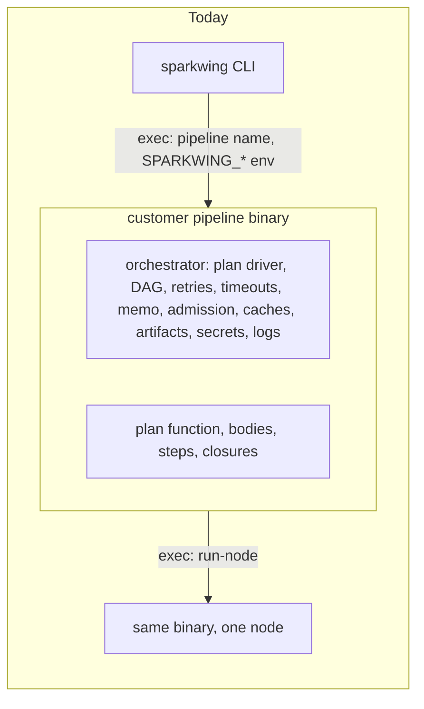
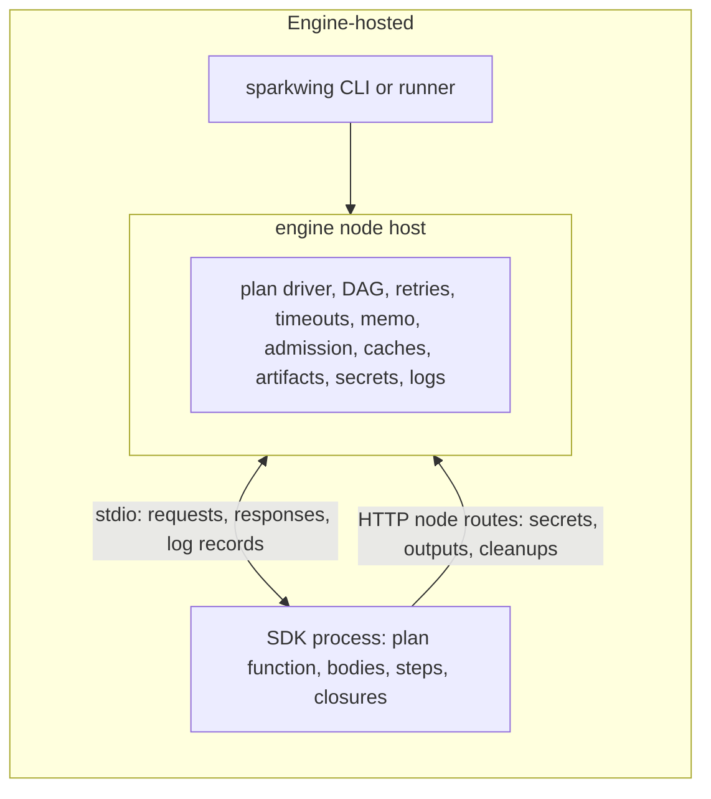
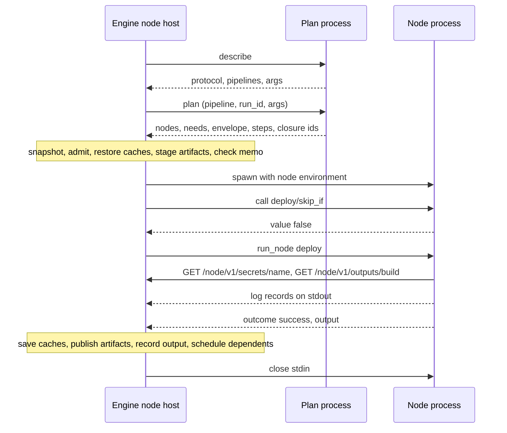
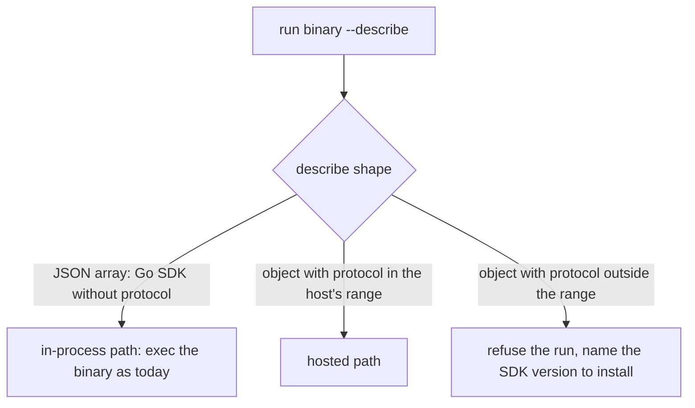

# Engine-hosted execution

Status: proposal. This page is a design for contributors; no released
command behaves this way yet.

Sparkwing runs every pipeline through one execution model: the engine hosts
the run, and the customer's SDK process answers for the parts only it can
run. The engine evaluates nothing written in the customer's language. It
asks the SDK process for the plan, then schedules the plan, dispatches
nodes, retries, times out, caches, stages artifacts, admits work, resolves
secrets and handles logs. The SDK process builds plans, runs node and step
bodies, and evaluates closures when the engine asks for them by id.

The Go SDK keeps its in-process path until it speaks the node protocol. A
TypeScript SDK starts on the hosted path and never has an in-process one.

## Where the orchestrator lives

Today the orchestrator is a library compiled into the customer's pipeline
binary. The CLI builds the binary and executes it with the pipeline's name;
the binary plans, schedules and dispatches its own nodes, starting each node
as another copy of itself with `run-node`. A controller-dispatched run
starts the binary with `handle-trigger`, which does the same. Every engine
behavior therefore ships at whatever SDK version the customer pinned, and
none of it is reusable from another language.





## The boundary

| Concern | Hosted in the engine | Stays in the SDK process |
|---|---|---|
| Plan | asks for the plan with the run's args and run context, validates it, records the snapshot, checks each node process plans the same graph | runs the author's plan function and returns the plan document |
| DAG | readiness, fan-out, dependency failure, optional dependencies, OnFailure recovery nodes | nothing |
| Retries and timeouts | attempts, backoff, wall and no-progress timeouts, killing the node's process session | nothing |
| Memo | key from declared inputs hashed by the host, lookup and record | a key closure returns a string when the author wrote one |
| Admission | per-node leases from declared resources, measured per-node usage | may send `exec_end` records with numbers it has |
| Artifacts | staging before the node starts, publishing after success | nothing |
| Dependency caches | restore before the node process starts, save after success, keyed from declared key files | declares the cache directories |
| Secrets | resolves through the profile, registers values with the masker, answers the secrets route | asks the route by name |
| Logs | reads stdout and stderr, masks, timestamps, stores | writes log records to stdout |
| Steps | orders steps, applies fail-fast, finally, continue-on-error, skip ranges and dry-run | runs one step body when asked |
| Closures | decides when to call SkipIf, BeforeRun, AfterRun, Verify, key closures and generators | evaluates the closure by id |
| Cleanup and git cache | owns the cleanup ledger and puts the git cache rewrite into the node environment | registers cleanups through a route |

## Process model

The engine starts one SDK process per node attempt. That process is
long-lived for the attempt: it answers one `run_node`, or a sequence of
`run_step` requests, plus any `call` requests the host sends for that node.
Plan evaluation before dispatch runs in its own short process, which also
answers closures the host evaluates before any node starts.

One process per attempt is the choice because:

- the process is the unit the host measures, so per-node CPU and memory are
  exact without SDK cooperation;
- a timeout or cancel kills one process session and nothing else;
- a retry starts clean, with no state left by the failed attempt;
- it matches the remote shape, where a node already runs in its own pod or
  launcher job.

The cost is that every node process rebuilds the plan, because bodies and
closures are captured while the plan function runs. The Go path pays the same
cost today. The host compares the node's plan entry with the accepted
snapshot and fails the node with a plan-drift reason when they differ.

One process per run was the alternative. It saves plan evaluations, but a
crash or leak in one body takes every node down, usage is no longer per
node, and it does not map onto pods.

### Framing

- The host writes one JSON request per line to the process's stdin.
- The process writes one JSON object per line to stdout. A line with a
  numeric `id` answers the request with that id; every other line is a log
  record with the engine's log record fields.
- stderr lines become warn-level text records, as they do for Go nodes.
- End of stdin means the host is gone; the SDK exits. This replaces the
  inherited liveness descriptor the Go path uses.

```text
-> {"id":1,"method":"run_node","params":{"pipeline":"ship","run_id":"r1","args":{},"node":"build"}}
<- {"ts":"2026-01-02T03:04:05Z","level":"info","node":"build","msg":"compiling"}
<- {"id":1,"result":{"outcome":"success","output":{"digest":"sha-1"}}}
```

| Method | Params | Result |
|---|---|---|
| `describe` | none | the describe document |
| `plan` | `pipeline`, `run_id`, `args` | the plan document |
| `run_node` | run params, `node` | `outcome`, optional `output`, optional `error` |
| `run_step` | run params, `node`, `step` | `outcome`, optional `error` |
| `call` | run params, `closure` | `value` |
| `shutdown` | none | null; the process exits |

A body that throws is a `failed` outcome, not a protocol error. Protocol
errors carry a code (`unknown_method`, `unknown_node`, `unknown_closure`,
`bad_request`, and similar) and fail the node with a reason that names the
SDK, so an author sees "this SDK does not support X" rather than a crash.

### Closures by id

The plan document names every closure a node has, with an id the SDK
assigns, such as `deploy/skip_if`. The host decides when a closure runs
and sends `call` with that id. The SDK looks the closure up in the plan it
built for the same run and args. A closure id the SDK does not know is a
protocol error, never a skipped check.



## What describe and the plan document carry

`--describe` stays static: no run context, no args. It gains a `protocol`
field and an `sdk` object so the host can choose the path before anything
runs. The plan document is per run and comes back from the `plan` request.

```json
{
  "protocol": 1,
  "sdk": {"language": "typescript", "version": "0.1.0"},
  "pipelines": [{"name": "ship", "short": "Build and deploy", "args": []}]
}
```

```json
{
  "pipeline": "ship",
  "nodes": [
    {"id": "build", "needs": [], "retry": {"attempts": 2, "backoff_ms": 1000}, "timeout_ms": 600000},
    {"id": "deploy", "needs": ["build"],
     "steps": [{"id": "apply", "needs": []}],
     "closures": {"skip_if": "deploy/skip_if"}}
  ]
}
```

The Go plan snapshot already carries most of the envelope (`deps`,
`optional_deps`, retry, timeouts, labels, concurrency, resources, memo flag,
steps with their needs). The hosted path still needs these in the plan
document:

- the protocol version and SDK identity in describe;
- cache directories as data: name, path or resolver, key files;
- memo key inputs as data: file globs, environment names, constants;
- closure ids for each closure, where the snapshot has only `has_skip_if`
  and similar flags;
- step ids with finally, optional and continue-on-error flags, and a closure
  id for a step's skip predicate;
- generator closure ids for nodes expanded at run time;
- approval and OnFailure configuration in a form the host can act on
  without reconstructing Go values;
- a stable node hash the host compares across processes.

## Pinned Go pipelines during the migration

The host negotiates by reading describe before every run:



- A Go binary built against any released SDK prints a JSON array. The host
  treats that as protocol 0 and runs it exactly as today, with the
  orchestrator inside the binary.
- The CLI and runner learn to read both shapes before any SDK prints the
  object form, because an older CLI that meets the object form cannot list
  the binary's pipelines.
- The Go SDK moves to the hosted path by answering `serve` and printing the
  object form. Its in-process path remains until every engine that customers
  run can host it, and its removal is a separate breaking release.
- The host supports a range of protocol versions. A minor addition, such as a
  new closure kind, is a capability the SDK lists in describe; a missing
  capability makes the host refuse the feature for that pipeline with a
  clear reason rather than guess.

## Changes by component

| Component | Today | Hosted |
|---|---|---|
| CLI `run` | builds the binary, passes run options as `SPARKWING_*` variables, execs `<binary> <pipeline>` | builds the SDK entry, runs the host in-process or through the admission daemon, keeps step windows, dry-run, only and no-cache as host state |
| CLI `pipeline describe`, `plan`, `explain` | asks the binary for its own help and plan text | renders describe and the plan document |
| Local runner | starts `<binary> run-node --coordinated` and supervises it | starts `<entry> serve`, sends requests, reads results from stdout instead of re-reading the node row |
| Runner and trigger loop | execs `<binary> handle-trigger`, and the binary dispatches | dispatches in the engine from the plan document; nodes still run the SDK entry |
| Launcher and Kubernetes jobs | job args `run-node <run> <node>`, claim fence in the pod environment | job args `serve`; the executor holds the claim, and the pod gets only the node environment |
| Admission daemon | leases taken by the binary's dispatcher | leases taken by the host per node |

The node environment shrinks to what an SDK reads: run and node ids, the
node route location and its bearer, runner identity, dry-run, trace context,
and the dependency proxy names other tools already define. Everything that
carries a CLI flag into the binary today becomes host state.

## Failure modes

| Failure | Host behavior |
|---|---|
| SDK process exits without answering | the node fails with the exit status or signal as its reason; the retry policy applies; records already read are kept |
| SDK process hangs | the wall or no-progress timeout kills the session; no-progress counts log silence |
| Response id the host never sent, or two answers to one id | the node fails with a protocol error; the host never guesses which answer counts |
| Non-JSON stdout line | forwarded as a text record, as for Go nodes; it is never parsed as a response |
| Node process plans a different graph | the node fails with a plan-drift reason |
| Protocol version outside the host's range | the run is refused before any node starts |
| Unknown method or closure | the node fails with the SDK's error code and the SDK version in the reason |
| Host restarts mid-node | the node process sees end of stdin and exits; the run's recovery marks the attempt lost and the retry policy decides, as it does when a dispatcher dies today |
| Secrets or outputs route fails | the SDK raises inside the body, so the node fails with that error |

## Phases

1. **Spike (in the tree).** An internal entry point reads a Go binary's
   describe document, writes the run row, asks the binary for
   `plan --json`, writes node rows and schedules the DAG itself, starting
   each node through the local runner as `run-node`. A test runs a two-node
   plan with one dependency and a dependency failure. No command reaches it.
2. **Smallest first step: plan without a controller.** Let `plan --json`
   take its run context on stdin instead of reading a run row through the
   controller, and have the spike use it. This is additive, needs no new
   variable, and makes plan evaluation a pure stdio exchange.
3. **Hosted local runs for protocol 1 entries.** The CLI recognises the
   object describe form and runs the host locally: scheduling, retries,
   timeouts, log forwarding, and the secrets and outputs routes on loopback.
   The TypeScript SDK runs end to end here.
4. **Envelope moves.** Memo, dependency caches, artifacts, steps and closure
   calls run host-side for hosted entries, from the plan document.
5. **Go SDK on the protocol.** The Go SDK answers `serve` and prints the
   object form. Runners, the launcher and Kubernetes jobs use the hosted
   path for protocol 1 binaries and the in-process path for older ones.
6. **In-process removal.** A breaking release removes the in-process path
   once supported engines all host protocol 1.

## What the spike proved

- The engine can own the run row, node rows and DAG order while the binary
  only evaluates the plan and runs one node per process. Each node ran in
  its own process, the dependent started only after its dependency
  succeeded, and a failed dependency skipped its dependent without starting
  it.
- A node reads its dependency's typed output through the engine, and its
  log records reach the host through stdout unchanged.
- The current verbs couple plan evaluation to a controller: `plan --json`
  reads the run row through the controller, and `run-node` re-reads the run
  row, rebuilds the whole plan and writes its own terminal row, which the
  host reads back instead of receiving a result.
- `--describe` carries no nodes, no edges, no envelope and no protocol
  version, so the host cannot schedule from describe alone.

## Open questions

- Whether the node routes are served on loopback HTTP with a bearer, or on
  a unix socket. A URL is simpler across languages.
- Whether a node's output travels only in the `run_node` result, or also
  through `PUT /node/v1/outputs` for nodes that publish before they finish.
  One writer is simpler; the TypeScript prototype has both.
- Whether concurrent `call` requests during a running body are allowed. The
  TypeScript prototype answers requests one at a time.
