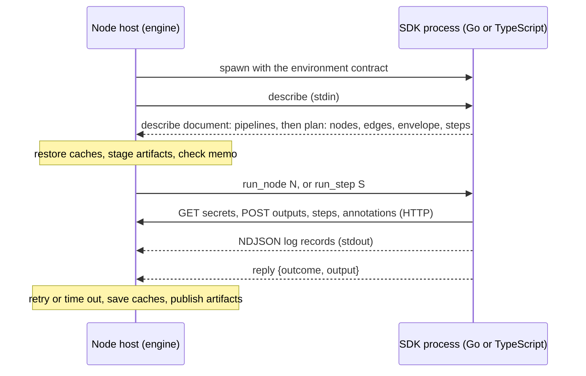

# Node protocol

The node protocol is the contract between the engine, which hosts a run, and an SDK process, which holds a pipeline's code. Any language can implement the SDK side: it reads the environment below, answers the engine's requests, calls the node-facing HTTP routes, and writes log records to stdout. This page is the contract; the Go SDK in `sparkwing/` is one implementation of it.

Each part of the contract is marked **Today** (the engine and the Go SDK do this) or **Target** (the contract the engine-hosted model needs; no SDK does it yet). The two JSON Schema files mark target fields the same way: a field whose description starts with `Target:` is not emitted yet.

## Two execution models

**In-process (Go, today).** The pipeline binary links the Go SDK and the orchestrator. `sparkwing run` builds the binary and starts it; the binary plans the run, schedules nodes, and runs each node either in its own process or in a child it starts with `run-node`. Retries, timeouts, memo lookup, step scheduling and dependency caches all execute inside the customer's binary.

**Engine-hosted (target, every language).** The engine plans and schedules. For each node it starts one SDK process as a session leader, sends it requests over stdin, reads replies and log records from stdout, and serves the node-facing routes on a loopback URL. The SDK process evaluates the pipeline's code and closures and nothing else: retries, timeouts, step order, memo keys, dependency caches, secret masking and process cleanup belong to the host.

Migration path:

1. The routes, the environment, the describe document and the log record below are versioned now, and the Go SDK speaks them.
2. The engine gains a node host that starts an SDK process and drives it over stdio. A TypeScript SDK targets this host from its first release.
3. The Go SDK moves its engine logic (dependency cache, secret resolution, process handling, cleanup ledger, git cache rewrite, key hashing) behind the host and keeps every exported signature.
4. The in-process path is removed once the Go SDK runs on the host.



## Environment contract

The host sets these variables in the SDK process's environment. Values are strings. A descriptor named by a `_FD` variable is inherited from the host, and the SDK closes it when it is done with it.

| Variable | Meaning | Value | Set by, today |
|---|---|---|---|
| `SPARKWING_RUN_ID` | Run the node belongs to | run id | local runner, Kubernetes and launcher Jobs; the brokered child gets it in argv only |
| `SPARKWING_NODE_ID` | Node the process runs | node id | as above |
| `SPARKWING_CONTROLLER_URL` | Base URL of the node-facing routes | absolute `http` or `https` URL | local runner (loopback controller), broker supervisor (broker URL), Kubernetes and launcher Jobs |
| `SPARKWING_AGENT_TOKEN` | Bearer for the node-facing routes | opaque token | Kubernetes and launcher Jobs, local runner without an API socket; the brokered child reads its bearer from stdin instead. A pipeline binary removes it from its environment at start, so the commands a step runs do not inherit it |
| `SPARKWING_LOG_FORMAT` | Log record encoding on stdout | `json` | local runner |
| `SPARKWING_MASK_VALUES_FD` | Descriptor the SDK writes each secret value to, one base64 line per value, so the host masks it in every log | decimal descriptor number of at least 3 | local runner, broker supervisor, launcher Job |
| `SPARKWING_PARENT_LIVENESS_FD` | Read end of a pipe the host holds open; end of file means the host is gone, and the SDK cancels its work and exits | decimal descriptor number of at least 3 | local runner |
| `SPARKWING_RUNNER_NAME` | Runner that hosts the node, for `Runtime().Runner` | name | local runner, Kubernetes Job |
| `SPARKWING_RUNNER_TYPE` | Kind of that runner | `local` or `kubernetes` | local runner, Kubernetes Job |
| `SPARKWING_RUNNER_LABELS` | Labels of that runner, for `WhenRunner` | comma-separated labels | local runner, Kubernetes Job |
| `TRACEPARENT` | W3C trace context of the run | `traceparent` header value | trigger children only |
| `SPARKWING_CACHE_URL` | Artifact store for SDK cache helpers | URL | local runner, Kubernetes and launcher Jobs |
| `SPARKWING_GITCACHE_URL` | Git mirror for the SDK's clone helper | URL | Kubernetes and launcher Jobs |
| `SPARKWING_CACHE_GRANT` | Run-scoped bearer for the two caches above | opaque token | broker supervisor, launcher Job, Kubernetes Job |

The last three rows apply only while an SDK ships its own cache helpers. Under the hosted model the host restores and saves dependency caches from the describe document and points `git` at the mirror through `GIT_CONFIG_COUNT` entries, so a hosted SDK needs none of the three.

The dependency-proxy variables `GOPROXY`, `npm_config_registry`, `PIP_INDEX_URL` and `PIP_TRUSTED_HOST` are not part of this contract: every package manager already reads them, so the host sets them and the SDK does nothing.

Run options are not environment variables in this contract; [Run options](#run-options) carries them.

### Variables outside the contract

The Go in-process path reads more variables than the contract names. They exist because the orchestrator runs inside the customer's binary, and an SDK in another language never reads them:

- `SPARKWING_API_SOCKET`: a unix socket the local Go child uses in place of URL plus bearer.
- `SPARKWING_LOGS_URL`: the logs service for direct appends; the hosted model reads log records from stdout.
- `SPARKWING_HOME`, `HOME`, `GOCACHE`, `GOMODCACHE`, `GOFLAGS`: Go toolchain and state locations.
- `SPARKWING_NODE_CLAIM_HOLDER`, `SPARKWING_NODE_CLAIM_GENERATION`, `SPARKWING_NODE_CLAIM_MEMBERSHIP`, `SPARKWING_NODE_CLAIM_RESERVATION`, `SPARKWING_NODE_CLAIM_LEASE_SECONDS`, `SPARKWING_NODE_SPEC_HASH`: the claim fence, which the engine-side executor holds.
- `SPARKWING_EXECUTION_CAPABILITY_STDIN`, `SPARKWING_BROKERED_ARTIFACTS`, `SPARKWING_BROKERED_NODE_CLAIM`: broker-mode switches.
- `SPARKWING_LEASE_TOKEN`, `SPARKWING_CHILD_LEASE_TOKEN`: admission leases for nested runs.
- `SPARKWING_SOURCE_DIR`, `SPARKWING_GATE_INDEX`: checkout and hook staging paths.
- `SPARKWING_START_AT`, `SPARKWING_STOP_AT`, `SPARKWING_DRY_RUN`, `SPARKWING_ONLY`, `SPARKWING_NO_CACHE`, `SPARKWING_PROFILE`, `SPARKWING_MODE`, `SPARKWING_WORKERS`, `SPARKWING_DEBUG_PAUSE_BEFORE`, `SPARKWING_DEBUG_PAUSE_AFTER`, `SPARKWING_DEBUG_PAUSE_ON_FAILURE`: run options and debug pauses, which [Run options](#run-options) replaces.

## Transport

**Today.** A node reaches the routes below at `SPARKWING_CONTROLLER_URL` with `Authorization: Bearer <token>`. Three hosts answer them:

- the **loopback controller** a local run starts on `127.0.0.1`, with a run-scoped token in `SPARKWING_AGENT_TOKEN`;
- the **execution broker** a remote runner starts on `127.0.0.1` for one node. The child reads its bearer, a per-node capability, from stdin. The broker checks every request against its allowlist, replaces the bearer with the runner's own credential, sets the claim-fence headers itself, and forwards to the controller or the logs service;
- the **controller** itself, for a Kubernetes or launcher Job that holds a claim token.

The Go child on a local run may use the unix socket in `SPARKWING_API_SOCKET` instead of URL plus bearer. The socket stays as a Go-only optimization; it is not part of the contract.

**Target.** The node host always gives the SDK a loopback URL and a bearer, and serves the routes itself in the shape of the broker: one node's run and node only, credentials and fence added by the host.

## Versioning

The protocol version is a string, currently `1`.

- Every request to a node-facing route carries the header `Sparkwing-Node-Protocol: <version>`. **Today** the Go SDK sends it, and the loopback controller and the broker log one warning per listener when a request names a different version or none, then serve the request.
- The describe document and the plan document carry `"protocol": "<version>"`. **Target.**
- A change that removes or renames a route, a field, an environment variable or a request, or changes a field's meaning, takes a new version. Adding an optional field or a route does not.
- **Target:** a host that receives a version it does not speak answers HTTP 426 with `{"error": "node protocol <got> unsupported", "supported": ["1"]}` and refuses a describe document with that version. Pipeline binaries pin the SDK they were built with and outlive engine upgrades, so a host keeps serving every version it has shipped until a release removes one with a migration note.

## Node-facing routes

Every route a node calls today, and the routes the hosted model adds. **Reach** is how a node reaches the route: `broker` routes are on the execution broker's allowlist, and a local run's loopback controller serves the same paths; `direct` routes a node calls on the controller with its own credential and the broker refuses; `target` routes no host serves yet. In a `broker` path, `{run}` matches only the node's own run, `{node}` the node's own id or a node it spawned (`<node>/<spawn id>`, sent as `<node>%2F<spawn id>`), `{anyrun}` any run, `{other}` matches any node of the same run whose id has no `/`, and `{spawned}` matches any node of the same run, including a spawned child's hierarchical id such as `build/linux`, sent with the slash escaped as `%2F`. Bodies are JSON unless stated; `?` marks an optional field. A test holds this table, the broker's allowlist and the controller's and logs service's route registrations equal.

<!-- node-routes:start -->
| Method | Path | Reach | Request | Response | Handler |
|---|---|---|---|---|---|
| GET | `/api/v1/runs/{anyrun}` | broker | none; `include=nodes` adds the nodes, and `include=secret_values` is refused for any run but the node's own | 200 run record | `pkg/controller/handlers.go` `handleGetRun` |
| GET | `/api/v1/triggers/{run}` | broker | none | 200 trigger record | `pkg/controller/handlers.go` `handleGetTrigger` |
| POST | `/api/v1/triggers` | broker | a trigger request `{pipeline, args?, trigger?, git?, parent_run_id, parent_node_id, retry_of?}`, for `RunAndAwait`; `parent_run_id` is the node's run and `parent_node_id` the node or a node it spawned | 201 `{run_id, status}` | `pkg/controller/handlers.go` `handleTrigger` |
| GET | `/api/v1/triggers/spawned-child` | broker | query `parent_run_id`, `parent_node_id` = the node or a node it spawned, `pipeline` | 200 `{run_id}`, empty when the node started none | `pkg/controller/handlers.go` `handleFindSpawnedChildTrigger` |
| GET | `/api/v1/pipelines/{name}/latest` | broker | query `status`, `max_age`; for a pipeline reference | 200 the newest matching run; 404 when none | `pkg/controller/handlers.go` `handlePipelineLatest` |
| GET | `/api/v1/runs/{run}/steps` | broker | none | 200 `{steps: [step]}` | `pkg/controller/handlers.go` `handleListNodeSteps` |
| GET | `/api/v1/runs/{run}/nodes/{node}` | broker | none | 200 node record | `pkg/controller/handlers.go` `handleGetNode` |
| GET | `/api/v1/runs/{run}/nodes/{other}` | broker | none | 200 node record | `pkg/controller/handlers.go` `handleGetNode` |
| GET | `/api/v1/runs/{anyrun}/nodes/{spawned}/output` | broker | none | 200 `{url?, sha256?, size?, expires?, source_run_id?}`; 409 until the node is done | `pkg/controller/node_output.go` `handleGetNodeOutput` |
| GET | `/api/v1/runs/{run}/nodes/{node}/bounce` | broker | none | 200 `{run_id, node_id, seq, requested_at, requested_by?, consumed_at?, outcome?}`; 204 when none is pending | `pkg/controller/bounce.go` `handlePendingNodeBounce` |
| GET | `/api/v1/secrets/{name}` | broker | query `run` = the node's run | 200 `{name, value?, principal, pipeline?, masked, shared?, bound, created_at, updated_at}`; 404 when unset | `pkg/controller/claim_run.go` `handleClaimSecret` for a claim token, else `pkg/controller/secrets.go` `handleGetSecret` |
| POST | `/api/v1/runs/{run}/events` | broker | `{node_id?, kind, payload?}`, payload base64 | 200 `{seq}` | `pkg/controller/handlers.go` `handleAppendEvent` |
| POST | `/api/v1/runs/{run}/heartbeat` | broker | none | 204 | `pkg/controller/handlers.go` `handleTouchRunHeartbeat` |
| POST | `/api/v1/runs/{run}/oidc-token` | broker | `{audience}` | 200 `{token, expires_at}`; 404 when the controller holds no signing key or the caller no live claim on the run | `pkg/controller/oidc_token.go` `handleOIDCToken` |
| POST | `/api/v1/runs/{run}/nodes` | broker | a node record `{id, status, deps?, ...}` for a node spawned at run time; through the broker `id` is `<node>/<spawn id>` under the node's own id | 201 | `pkg/controller/handlers.go` `handleCreateNode` |
| POST | `/api/v1/runs/{run}/nodes/{node}/start` | broker | none | 204 | `pkg/controller/handlers.go` `handleStartNode` |
| POST | `/api/v1/runs/{run}/nodes/{node}/finish` | broker | `{outcome, error?, output?: {key, size, sha256}, failure_reason?, exit_code?}` | 204; 422 on an invalid outcome or an uncommitted output | `pkg/controller/handlers.go` `handleFinishNode` |
| POST | `/api/v1/runs/{run}/nodes/{node}/deps` | broker | `{deps: [node id]}` | 204 | `pkg/controller/handlers.go` `handleUpdateNodeDeps` |
| POST | `/api/v1/runs/{run}/nodes/{node}/dispatch` | broker | `{seq, dispatched_at, code_version?, binary_hash?, runner_labels?, env_json?, workdir?, input_envelope_json?, input_size_bytes, secret_redactions, redacted_keys?}` | 201 | `pkg/controller/handlers.go` `handleWriteNodeDispatch` |
| POST | `/api/v1/runs/{run}/nodes/{node}/metrics` | broker | `{kind, ts, cpu_millicores, memory_bytes, cpu_time_nanos?}` | 204 | `pkg/controller/metrics.go` `handleAddNodeMetric` |
| POST | `/api/v1/runs/{run}/nodes/{node}/execution-start` | broker | `{holder_id, membership_id?, reservation_id?, claim_generation, attempt_ordinal, executor_kind?, executor_id?, executor_name?}`; the broker overwrites the fence fields | 204; 200 `{spec_hash}` for a claim token; 409 on a lost claim | `pkg/controller/handlers.go` `handleAcknowledgeNodeExecutionStart`, `pkg/controller/claim_run.go` `handleClaimExecutionStart` |
| POST | `/api/v1/runs/{run}/nodes/{node}/execution-finish` | broker | `{holder_id, membership_id?, reservation_id?, claim_generation, attempt_ordinal, outcome, failure_reason?, executor_kind?}` | 204; 409 on a lost claim | `pkg/controller/handlers.go` `handleFinishNodeExecutionAttempt` |
| POST | `/api/v1/runs/{run}/nodes/{node}/output-upload` | broker | `{size, sha256}` | 200 `{upload_id, key, url, headers?, expires_at}` | `pkg/controller/node_output.go` `handleOutputUpload` |
| POST | `/api/v1/runs/{run}/nodes/{node}/output-commit` | broker | `{upload_id}` | 204 | `pkg/controller/node_output.go` `handleOutputCommit` |
| POST | `/api/v1/runs/{run}/nodes/{node}/activity` | broker | `{detail}` | 204 | `pkg/controller/handlers.go` `handleUpdateNodeActivity` |
| POST | `/api/v1/runs/{run}/nodes/{node}/touch` | broker | none | 204; 503 with `Retry-After` when the store is busy | `pkg/controller/handlers.go` `handleTouchNodeHeartbeat` |
| POST | `/api/v1/runs/{run}/nodes/{node}/annotations` | broker | `{message}` | 204 | `pkg/controller/handlers.go` `handleAppendNodeAnnotation` |
| POST | `/api/v1/runs/{run}/nodes/{node}/summary` | broker | `{markdown}` | 204 | `pkg/controller/handlers.go` `handleSetNodeSummary` |
| POST | `/api/v1/runs/{run}/nodes/{node}/artifact-manifest` | broker | `{manifest_digest}` | 204 | `pkg/controller/handlers.go` `handleSetNodeArtifactManifest` |
| POST | `/api/v1/runs/{run}/nodes/{node}/steps/start` | broker | `{step_id}` | 204 | `pkg/controller/handlers.go` `handleStartNodeStep` |
| POST | `/api/v1/runs/{run}/nodes/{node}/steps/finish` | broker | `{step_id, status}` | 204 | `pkg/controller/handlers.go` `handleFinishNodeStep` |
| POST | `/api/v1/runs/{run}/nodes/{node}/steps/skip` | broker | `{step_id}` | 204 | `pkg/controller/handlers.go` `handleSkipNodeStep` |
| POST | `/api/v1/runs/{run}/nodes/{node}/steps/annotations` | broker | `{step_id, message}` | 204 | `pkg/controller/handlers.go` `handleAppendStepAnnotation` |
| POST | `/api/v1/runs/{run}/nodes/{node}/steps/summary` | broker | `{step_id, markdown}` | 204 | `pkg/controller/handlers.go` `handleSetStepSummary` |
| POST | `/api/v1/runs/{run}/nodes/{node}/bounce/consume` | broker | `{seq, outcome?}` | 204 | `pkg/controller/bounce.go` `handleConsumeNodeBounce` |
| POST | `/api/v1/runs/{run}/nodes/{node}/status` | broker | `{status}` | 204 | `pkg/controller/handlers.go` `handleSetNodeStatus` |
| GET | `/api/v1/concurrency/{key}/holder` | broker | query `holder_id` = `<run>/<node>` | 200 `{holder_id, run_id, node_id?, claimed_at, queue_arrived_at?, lease_expires_at, superseded, cost?}`; 404 when not held | `pkg/controller/concurrency.go` `handleObserveSlot` |
| GET | `/api/v1/concurrency/{key}/resolve` | broker | query `run_id`, `node_id` = the node's own, optional `cache_key_hash`, `leader_run_id`, `leader_node_id`, `bypass_read` | 200 `{status, holder_id?, holder_lease_expires?, output_ref?, origin_run_id?, origin_node_id?, leader_run_id?, leader_node_id?, leader_outcome?, leader_failure_reason?, position?, queue_length?, holders?}` | `pkg/controller/concurrency.go` `handleResolveWaiter` |
| GET | `/api/v1/concurrency/{key}/state` | broker | none; a `RunAndAwait` parent reads its child's plan admission | 200 group state; 404 when the group is unknown | `pkg/controller/concurrency.go` `handleConcurrencyState` |
| POST | `/api/v1/concurrency/{key}/acquire` | broker | `{holder_id, run_id, node_id?, max?, cost?, policy?, cache_key_hash?, cache_ttl_ns?, cancel_timeout_ns?, lease_secs?, bypass_read?}`; `holder_id` is `<run>/<node>` and `inherited_holder_id` is empty | 200 granted or cached, 202 queued, 429 skipped or failed; `{granted, kind, holder_id?, lease_expires_at?, output_ref?, position?, queue_length?, holders?}` and the leader and origin fields | `pkg/controller/concurrency.go` `handleAcquireSlot` |
| POST | `/api/v1/concurrency/{key}/heartbeat` | broker | `{holder_id, lease_secs?}` | 200 `{lease_expires_at, cancelled_by_newer}` | `pkg/controller/concurrency.go` `handleHeartbeatSlot` |
| POST | `/api/v1/concurrency/{key}/release` | broker | `{holder_id, outcome, output_ref?, cache_key_hash?, cache_ttl_ns?}` | 204 | `pkg/controller/concurrency.go` `handleReleaseSlot` |
| POST | `/api/v1/concurrency/{key}/cancel-waiter` | broker | `{run_id, node_id?}` naming the node itself | 200 `{cancelled}` | `pkg/controller/concurrency.go` `handleCancelWaiter` |
| POST | `/api/v1/concurrency/{key}/force-release` | broker | none; a `CancelOthers` holder drops the holders it superseded once their cancel timeout passes | 200 `{dropped: [holder]}`; 403 `missing_scope` unless the credential is admin | `pkg/controller/concurrency.go` `handleForceRelease` |
| POST | `/api/v1/logs/{run}/{node}` | broker | NDJSON log records as `text/plain`, at most 4 MiB; optional `X-Sparkwing-Log-Stream`, `X-Sparkwing-Log-Seq`, `X-Sparkwing-Log-Seq-End` | 204 | `pkg/logs/server.go` `handleAppend` |
| GET | `/api/v1/logs/{run}/{node}` | broker | read filters as query | 200 `text/plain` or `application/x-ndjson` | `pkg/logs/server.go` `handleRead` |
| POST | `/api/v1/logs/{run}/{node}/seal` | broker | `{stream, final_seq, lines, bytes, dropped, sha256}` | 204 | `pkg/logs/seal.go` `handleSeal` |
| GET | `/api/v1/logs/{run}/{node}/seal` | broker | none | 200 seal report | `pkg/logs/seal.go` `handleReadSeals` |
| GET | `/api/v1/logs/{run}/{node}/stream` | broker | none | 200 event stream | `pkg/logs/server.go` `handleStream` |
| GET | `/bin/{key...}` | broker | key `artifacts/blobs/<sha256>` or `artifacts/manifests/<sha256>` | 200 `application/octet-stream`; 404 | the broker itself, `internal/orchestrator/remote_execution_broker.go` `serveArtifact` |
| HEAD | `/bin/{key...}` | broker | as GET | 200 or 404 | as GET |
| PUT | `/bin/{key...}` | broker | the blob; its sha256 must equal the key's digest | 201; 400 on a digest mismatch | as GET |
| POST | `/api/v1/runs/{id}/cache-grant` | direct | none | 200 `{grant, team, expires_at}` | `pkg/controller/cache_grant.go` `handleRunCacheGrant` |
| PUT | `/api/v1/outputs/uploads/{id}` | direct | the output bytes, at the URL `output-upload` granted | 200 | `pkg/controller/node_output.go` `handleOutputBlobPut` |
| GET | `/api/v1/outputs/objects/{key...}` | direct | none, at the URL `output` granted | 200 the output bytes | `pkg/controller/node_output.go` `handleOutputBlobGet` |
| POST | `/api/v1/runs/{id}/nodes/{nodeID}/attempt` | direct | an attempt report, claim token only | 200 `{status}` | `pkg/controller/claim_dispatch.go` `handleReportAttempt` |
| POST | `/api/v1/runs/{id}/nodes/{nodeID}/claim/input` | direct | `{kind, key?, cache_key_hash?, pipeline?, node?, max_age_ms?}`, claim token only | 200 the input | `pkg/controller/claim_run.go` `handleClaimInput` |
| POST | `/api/v1/runs/{id}/children` | direct | `{ordinal, pipeline, args?, repo?, branch?}`, claim token only | 200 the child run | `pkg/controller/claim_run.go` `handleEnqueueChildRun` |
| GET | `/api/v1/runs/{id}/children/{childID}` | direct | none | 200 the child run | `pkg/controller/claim_run.go` `handleGetChildRun` |
| GET | `/api/v1/runs/{id}/children/{childID}/nodes/{nodeID}/output` | direct | none | 200 output grant | `pkg/controller/claim_run.go` `handleGetChildNodeOutput` |
| POST | `/api/v1/runs/{id}/nodes/{nodeID}/logs` | direct | live log lines | 204 | `pkg/controller/livelogs_http.go` `handleAppendNodeLiveLog` |
| GET | `/node/v1/secrets/{name}` | target | none | 200 `{value, masked}`; the host registers the value with the masker before it answers | node host |
| POST | `/node/v1/cleanups` | target | `{argv: [string], description}` | 201 `{id}`; the host runs argv when the node ends unless released | node host |
| DELETE | `/node/v1/cleanups/{id}` | target | none | 204 | node host |
| POST | `/node/v1/oidc-token` | target | `{audience}` | 200 `{token, expires_at}` | node host |
<!-- node-routes:end -->

**Auth.** `broker` routes take the node's bearer; the broker or loopback controller confines it to the node's own run and node and the nodes it spawned. The broker then forwards with the runner's own credential, so the controller still decides: a runner token's live claim covers its own node only, and today the controller refuses a spawned node's row to it (`claim_required` or `held by another holder`); a runner token also lacks `runs.write`, `runs.read` and `triggers.read`, so `RunAndAwait`, pipeline references, reads of another run and the concurrency state answer it `missing_scope` or `claim_required`, and force-release takes `admin`. An admin or loopback run token is served. `direct` routes take a claim token or the loopback run token, and the controller checks the claim fence headers (`X-Sparkwing-Claim-Holder`, `X-Sparkwing-Claim-Membership`, `X-Sparkwing-Claim-Reservation`, `X-Sparkwing-Claim-Generation`) on writes. `PUT` and `GET` under `/api/v1/outputs/` take no bearer: the URL the grant returned is signed. `target` routes take the host's bearer and need no fence, because the host adds it.

**Target namespace.** Once the node host serves the routes, a node calls them under `/node/v1/` with the run and node implied by its bearer, so `/api/v1/runs/{run}/nodes/{node}/start` becomes `/node/v1/start`. The request and response bodies stay as listed.

## Requests over stdio

**Today.** The Go pipeline binary answers three argv forms the engine uses, and nothing is exchanged over stdin except the brokered child's bearer:

- `<binary> --describe` writes the describe array (`$defs/pipeline` of the describe schema, one element per pipeline) to stdout and exits.
- `<binary> plan --json` plans the run named by `SPARKWING_RUN_ID` and writes one plan document (`$defs/plan`) to stdout. Pipeline code's own stdout goes to stderr while it plans.
- `<binary> run-node [--controller <url>] [--logs <url>] [--timeout <d>] [--coordinated] <run> <node>` runs one node, writes NDJSON log records to stdout, and reports its result through the `finish` route. Exit status 0 is success, 1 is failure, 97 means the parent's liveness pipe closed.

**Target.** The host starts the SDK process once per node attempt with the single argument `--sw-node-protocol`. Requests arrive on stdin and replies leave on stdout, one JSON object per line. A reply carries `reply`, the id of the request it answers; every stdout line without `reply` is a log record. End of file on stdin means no further requests: the SDK finishes the current one and exits.

Requests:

| `op` | Fields | Reply `result` |
|---|---|---|
| `describe` | none | the describe document (root of the describe schema) |
| `plan` | `pipeline`, `args` (object of strings), `run` (run context: `run_id`, `pipeline`, git facts) | the plan document (`$defs/plan`) |
| `run_node` | `node`, `attempt` (1-based), `options` | `{outcome, error?, output?}`; `outcome` is one of `success`, `failed`, `skipped`, `cancelled`, and `output` is the node's JSON output |
| `run_step` | `node`, `step`, `options` | `{outcome, error?}` |
| `eval` | `closure` (id from the plan), `input?` | `{value}`: a boolean for `skip_if` and `verify`, a string for `cache_key`, null for `before_run` and `after_run` |

Every request is `{"id": "<id>", "op": "<op>", ...fields}`. A reply is `{"reply": "<id>", "ok": true, "result": {...}}` or `{"reply": "<id>", "ok": false, "error": {"message": "..."}}`. The host sends one request at a time per process, except `eval` requests for closures of a running node.

When a plan lists steps, the host sends one `run_step` per step in an order the step edges allow, applies fail-fast or collect-all from `failure_policy`, and runs `finally` steps last. A plan without steps gets one `run_node`.

## Run options

**Today.** `sparkwing run` hands the Go binary its run options as `SPARKWING_START_AT`, `SPARKWING_STOP_AT`, `SPARKWING_DRY_RUN`, `SPARKWING_ONLY`, `SPARKWING_NO_CACHE`, `SPARKWING_PROFILE`, `SPARKWING_MODE` and `SPARKWING_WORKERS`. The binary has no flags for them.

**Target.** Run options travel as one JSON object:

```json
{"start_at": "deploy", "stop_at": "smoke", "dry_run": true, "only": ["build"], "no_cache": true, "profile": "prod", "mode": "ci", "workers": 4}
```

The in-process Go binary takes it as one argument, `--sw-options=<json>`, consumed before pipeline flags are parsed, so a pipeline's flag bag never receives it. Under the hosted model the host applies `start_at`, `stop_at`, `only`, `no_cache`, `profile`, `mode` and `workers` itself, and `run_node` and `run_step` carry `options: {"dry_run": <bool>}`, which is the one option pipeline code observes. An absent field is the default.

## Closures

`BeforeRun`, `AfterRun`, `Verify`, `SkipIf` and `CacheKeyFn` are code, so the SDK evaluates them. **Today** the plan document marks their presence with `has_before_run`, `has_after_run` and `has_skip_if`, and the Go orchestrator calls them in process. **Target:** the plan lists each closure's id under `closures` on the node or step, and the host asks for one with `eval`. An id is opaque to the host and unique within the plan; the Go SDK uses `<node>/<kind>/<index>` and `<node>/<step>/<kind>/<index>`. The host enforces each closure's budget: a `skip_if` that errors or exceeds its budget evaluates to don't-skip.

## Describe and plan documents

[schemas/describe.schema.json](schemas/describe.schema.json) is the JSON Schema for both documents: the root is the `describe` reply, `$defs/pipeline` is one pipeline as `--describe` writes it, and `$defs/plan` is the plan. The plan carries:

- nodes and their edges: `deps`, `optional_deps`, `on_failure_of`, `pipeline_refs`, and step and spawn `needs`;
- each node's envelope under `modifiers`: `retry`, `retry_backoff_ms`, `retry_auto`, `timeout_ms`, `no_progress_timeout_ms`, `on_failure`, the required, preferred and `when_runner` placement labels, memo flag and `cache_ttl_ms`, the concurrency group (`conc_*`), resources (`res_cores`, `res_memory_bytes`), `inline`, `optional`, `continue_on_error`;
- artifacts as `outputs` (globs the node publishes) and `consumes` (producers it stages from);
- approvals, secrets, the source checkout and plan-level concurrency and resources;
- steps under `work`, with `needs`, `finally`, `is_result` and `failure_policy`;
- **target** fields: `caches` (dependency-cache directories the host restores and saves), `memo_key` (files, env and constants the host hashes, or a closure), `closures`, `tools`, and `protocol`.

A node's `spec_hash` covers the node's own fields, so a Job that plans again runs only a node whose hash the accepted plan holds.

## Log records

[schemas/log-record.schema.json](schemas/log-record.schema.json) is the JSON Schema for one line of stdout. A record is `{ts, level?, node?, step?, event?, msg?, attrs?}`. The host masks secret values in `msg` and `attrs` and may restamp `ts`.

Events a node writes:

- none: a plain message at `level`;
- `node_annotation`: `attrs` `{message, level?, file?, line?, end_line?}`. **Target:** `level`, `file`, `line` and `end_line` point the annotation at a source line, as a GitHub check annotation does;
- `node_summary`: `attrs` `{markdown}`; the last record per node and step wins;
- `step_start`, `step_end`, `step_skipped`, `work_fail_fast`: step lifecycle, written by whoever schedules steps;
- `exec_start` and `exec_line`: a command and each line of its output;
- `exec_end` (**target**): `attrs` `{exit_code?, cpu_ms?, max_rss?}` from a command that finished, when the SDK can measure it. The host measures each node process as a whole and needs no `exec_end` to do so.

An annotation that points at a line:

```json
{"ts":"2026-01-02T03:04:05.123Z","level":"error","node":"lint","event":"node_annotation","msg":"unused variable","attrs":{"message":"unused variable","level":"error","file":"cmd/app/main.go","line":42}}
```
